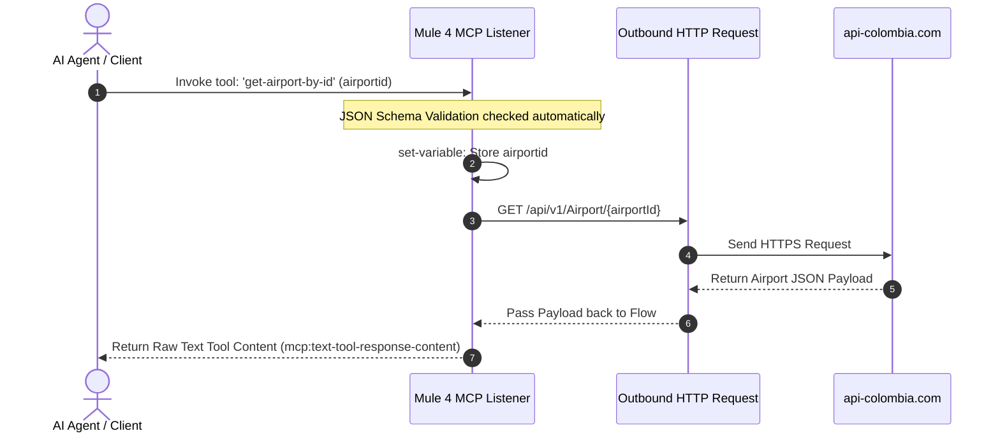

# MuleSoft Airport MCP Server

This Mule 4 application implements a Model Context Protocol (MCP) server that exposes a dedicated tool for Large Language Models (LLMs) and AI agents. It serves as an integration bridge between an MCP client (such as Claude Desktop) and the public `api-colombia.com` REST API to fetch operational data about  airports.

## 📋 Features

* **MCP Server Integration**: Spins up an MCP server instance (`colombia-mcp-server` v1.0.0) over an HTTP connection.
* **AI Tool Orchestration**: Exposes the `get-airport-by-id` tool to LLMs using a predefined JSON validation schema.
* **Target Integration**: Proxies requests securely to the external Colombia API via HTTPS.

## 🗺️ Execution Flow Chart

The diagram below outlines the message tracking lifecycle when an AI agent requests airport information through this application:



## 🛠️ Prerequisites

* **Mule Runtime**: Version 4.x
* **Anypoint Studio**: Version 7.x or higher
* **MCP Client**: An MCP-enabled environment (e.g., Claude Desktop, Cursor, or an application built with an MCP SDK)

## 🔧 Exposed Tools

### `get-airport-by-id`

Fetches technical and operational details for a specific  airport using its unique numeric identifier.

**Input Parameter Schema:**
```json
{
  "\$schema": "http://json-schema.org",
  "type": "object",
  "properties": {
    "airportid": {
      "type": "integer",
      "minimum": 1,
      "description": "The unique numeric ID of the  airport to fetch (e.g., 1)."
    }
  },
  "required": ["airportid"]
}
```

## 🚀 Deployment & Configuration

### 1. Run the Application
Deploy this project to your local Mule runtime or launch it via Anypoint Studio. By default, the HTTP listener binds to:
* **Host**: `0.0.0.0`
* **Port**: `8081`

### 2. Connect Your MCP Client
Add this server to your local client configuration file (e.g., `claude_desktop_config.json`). Depending on how your Mule MCP plugin exposes its endpoint over HTTP, point your Server-Sent Events (SSE) or HTTP Bridge configuration to your local listener:

```json
{
  "mcpServers": {
    "colombia-airport-mcp": {
      "command": "mcp-http-bridge-client",
      "args": ["http://localhost:8081/mcp"]
    }
  }
}
```
## Postman


## 🛡️ Error & Exception Handling

* **Schema Failures**: If an LLM passes a non-integer or negative value, the MCP validation block automatically reports an execution failure back to the host client.
* **Upstream Service Errors**: Connectivity disruptions or broken paths targeting `api-colombia.com` are caught by the HTTP request component and passed back inside the tool's textual content container.
